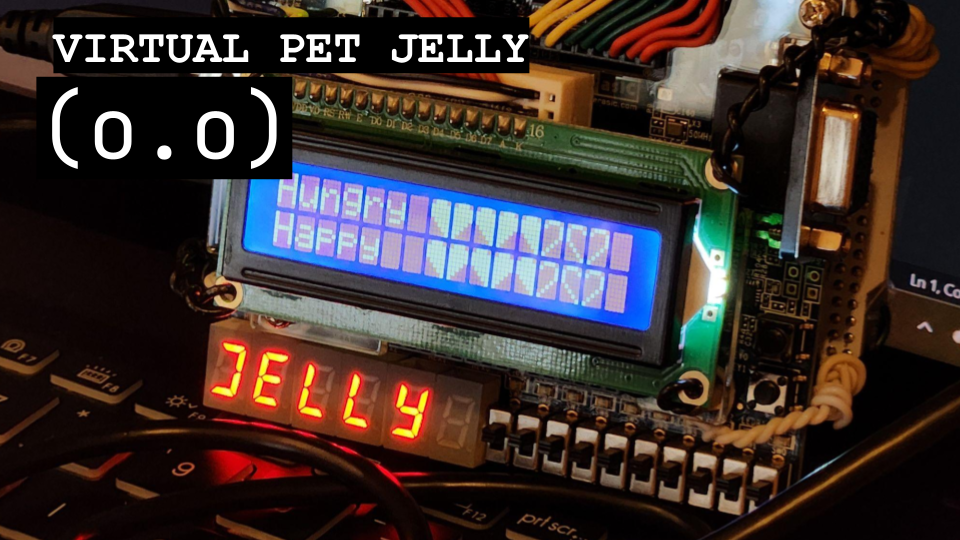

# Virtual Pet Jelly!
*Made for [Hack the Coast 2026](https://devpost.com/software/virtual-pet-jelly) - a 24-hour hackathon*

In an increasingly digital world, we wanted to bridge the gap between hardware and emotional support. Inspired by the comforting nostalgia of childhood virtual pet games, we developed a companion that encourages tactile, real-world interaction rather than passive screen time. Our goal was to explore how low-level hardware can create a sense of comfort, interactivity and responsibility.

## Demo video

## What it does
Take care of a virtual pet and practice emotional grounding through physical and button-based interactions. The pet’s internal state acts as a mirror for the user’s attentiveness, encouraging a routine of care through physical interaction and empathy-based logic.
- **Pet** your virtual companion  
- **Play** with it  
- **Shake** it using real-world motion  
- **Feed** it to maintain its hunger level  

Each interaction affects the pet’s internal state and behaviour.

## Tech Stack

| Component | Technology | Role |
| :--- | :--- | :--- |
| **FPGA** | Terasic DE10-Lite (Intel MAX 10) | Central Logic & State Management |
| **HDL** | SystemVerilog | FSM Design & Hardware Description |
| **Sensors** | ADXL345 Accelerometer | Real-time shake detection |
| **Microcontroller** | Arduino (C++) | Serial Monitor interface & Status Display |
| **Tools** | Quartus Prime | Synthesis, Bitstream Generation |

---

## How we built it
The system is designed as a distributed architecture where the FPGA acts as the "brain" and the Arduino acts as the "display driver."

### SystemVerilog FSMs
We implemented Finite State Machines (FSMs) into the FPGA for deterministic state transitions:
* **Game Logic:** Tracking internal vitals like hunger, happiness, and energy.
* **Interaction Handling:** Handing button presses (Feed/Play).
* **Motion Detection:** Processing raw data from the onboard **ADXL345 accelerometer** to trigger "shake" events.

### Hardware Integration & Communication
* **The FPGA** evaluates the internal state and outputs encoded signals through the DE10-Lite’s Arduino-compatible I/O pins.
* **The Arduino** interprets these hardware signals and formats them for the Serial Monitor and LCD, providing a live status feed of your pet's

## Challenges we ran into
Our original plan was to integrate RTOS with HDL logic on the DE10-Lite to combine HDL and C to print directly to the terminal. However, we could not find clear documentation on how to integrate these components. In the end, we decided to pivot by using an Arduino for output and display, which allowed us to move forward with our project.

## Accomplishments that we're proud of
We accomplished a lot of new and challenging things in a short amount of time:
- Designed and implemented **two fully functional finite state machines**
  - One FSM handles the game logic and pet behaviour
  - One FSM processes accelerometer data to accurately detect a “shake,” with adjustable sensitivity
- Successfully interfaced a **DE10-Lite FPGA with an Arduino**
- Communicated real-time FPGA outputs to external hardware using Arduino I/O pins
- Implemented reliable shake detection using real sensor data instead of simulated input
- Wiring hardware components cleanly and securely

## What we learned
- How to design and debug complex FSMs in SystemVerilog  
- How to process and interpret accelerometer data on an FPGA  
- How to integrate FPGA hardware with external microcontrollers  
- How to adapt project scope and architecture when initial plans don’t work out  

## What's next?
Improve the visual output and user experience  
- Adding an LCD display to show the pet’s state directly on the device and everything into a single standalone unit instead of relying on the Serial Monitor  
- Adding more interactions and pet behaviours using different types of sensors for greater interactivity (e.g. light and temperature)
